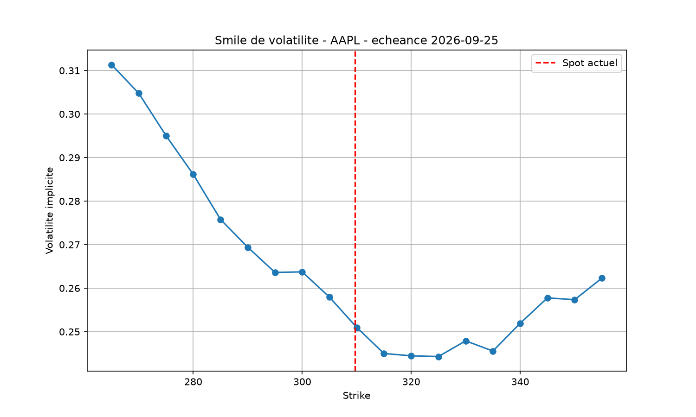

# Options Pricer — Black-Scholes, Monte Carlo & Implied Volatility


An interactive options pricing engine built from scratch in Python, connected to
live market data. Prices European and American options through three independent
methods, computes the full set of Greeks, reconstructs the implied volatility
surface from real quoted prices, and simulates a discretely rebalanced delta
hedge.

**[▶ Live demo](https://yaniv-options-pricer.streamlit.app)** · Built by Yaniv C. · [LinkedIn](https://linkedin.com/in/yaniv-cukierman-b384a139b/)



---

## Why this project

Anyone can say they are interested in derivatives. This project is an attempt to
actually understand how options are priced — by implementing the models rather
than reading about them, validating every result against a known identity, and
then confronting the theoretical output with what the market actually quotes.

The most interesting outcomes are not that the pricer works. They are the two
places where the theory visibly breaks down:

- the **volatility smile** above shows that Black-Scholes' single-constant-
  volatility assumption does not hold in the market;
- the **delta-hedging simulation** shows that a perfect hedge is unreachable in
  practice, and quantifies exactly how the residual risk decays.

---

## Features

### Pricing methods

- **Black-Scholes** — closed-form solution for European calls and puts
- **Monte Carlo** — 100,000 simulated paths under the risk-neutral measure
- **Binomial tree (CRR)** — 500 steps, European *and* American exercise

### Risk metrics

Delta, Gamma, Vega, Theta and Rho, from analytical formulas and expressed in
market conventions — Theta per calendar day, Vega and Rho per volatility or
rate point rather than per unit.

### Implied volatility

- Newton-Raphson inversion of the Black-Scholes formula
- Automatic fallback to Brent's method when Newton-Raphson diverges — vega
  approaches zero for deep ITM/OTM options, which makes the Newton step explode
- Arbitrage-bound check and relative tolerance, so an option with no remaining
  time value returns `None` instead of a meaningless number
- Volatility smile rebuilt from out-of-the-money contracts only (puts below
  spot, calls above), the standard approach on a trading desk
- 3D implied volatility surface across seven expiries, showing the term
  structure of the skew

### Delta-hedging simulation

- Sells a call, hedges it with `delta` shares, rebalances on a discrete grid
- Tracks a cash account earning the risk-free rate between rebalancings
- Measures the residual P&L and its decay as rebalancing gets finer

### Market data

- Live spot prices and option chains via `yfinance`
- Historical volatility from log returns, annualised over 252 trading days
- Works on any US-listed underlying

---

## Validation

Every pricing method is checked against an identity that *must* hold if the
implementation is correct — not against my own expectations.

| Test | Expected | Result (ATM, 30d, σ = 25%) |
|:---|:---|:---|
| Put-call parity — `C - P = S - K·e^(-rT)` | exact | ✅ holds |
| Monte Carlo vs Black-Scholes | convergence | 0.029 absolute gap |
| Binomial (European) vs Black-Scholes | convergence | 0.0045 absolute gap |
| Rho identity — `ρ_call - ρ_put = K·T·e^(-rT)` | exact | ✅ holds |
| Implied vol round-trip — `BS(σ_implied) = market price` | exact | 8.800000000000 vs 8.80 |
| American call = European call (no dividend) | equal | equal to 1e-8 |
| Early exercise premium (American put) | ≥ 0 | +0.0495 |
| All five Greeks vs numerical derivatives | match | ✅ all five |

The binomial tree converges an order of magnitude closer than Monte Carlo at
comparable settings — expected, since it is deterministic rather than sampled.

All of this is automated. From the project root:

```bash
pytest -v
```

96 test cases covering pricing identities, arbitrage bounds, Greeks against
numerical derivatives, method convergence, early exercise, implied volatility
inversion, hedging behaviour and extreme-parameter robustness.

---

## The cost of a discrete hedge

Black-Scholes assumes continuous rebalancing. In that idealised world, selling a
call and holding `delta` shares reproduces the option exactly and the hedger's
final P&L is zero. Real hedging happens on a discrete grid, and the gap is
measurable.

Over 300 simulated paths per frequency (S = K = 100, T = 1y, σ = 20%, r = 3%):

| Rebalancings | Mean P&L | Std deviation | Std × √n |
|---:|---:|---:|---:|
| 10 | +0.022 | 2.041 | 6.45 |
| 50 | +0.004 | 0.961 | 6.79 |
| 250 | +0.007 | 0.436 | 6.90 |
| 1,000 | +0.007 | 0.194 | 6.13 |

Two readings. The **mean is indistinguishable from zero** at every frequency:
delta hedging neutralises risk, it does not generate profit. And the last column
stays roughly constant while `n` varies by a factor of 100, which is the
signature of a **1/√n** decay.

That decay is the practical point. Going from 250 to 1,000 rebalancings
multiplies transaction costs by four and only cuts the residual risk in half.
This is why no desk hedges continuously, and why the choice of rebalancing
frequency is an economic decision rather than a technical one.

---

## What the model gets wrong

Black-Scholes assumes a single constant volatility per underlying. If that were
true, implied volatility would be identical across all strikes for a given
expiry — a flat line.

It is not. On AAPL 30-day options, implied volatility runs from **~31% at low
strikes** down to **~24% near the money**, then rises again for high strikes.
This skew reflects the premium investors pay for downside protection, a
structural feature of equity markets since 1987. Stacking several expiries makes
the term structure visible too: short-dated skew is steeper and noisier, longer
maturities flatten out.

Three further limitations worth stating plainly:

| Limitation | Consequence |
|:---|:---|
| Dividends are not modelled | Small but systematic bias in AAPL call prices |
| American calls priced as European | Correct without dividends; wrong for a dividend payer |
| Market data delayed ~15 min | Fine for analysis, unusable for execution |

The early-exercise premium becomes economically significant for deep
in-the-money American puts. On a long-dated example (S=250, K=350, 550 days),
the binomial tree prices the American put **8.6% above** its European
equivalent — a gap Black-Scholes cannot capture by construction.

The volatility surface is built from raw quotes without smoothing. Isolated
spikes come from illiquid contracts whose last traded price is stale; a desk
would fit a parametric model (SVI) before using such a surface.

---

## Running locally

```bash
git clone https://github.com/yaniv-cuki/option-pricer.git
cd option-pricer

python3 -m venv venv
source venv/bin/activate        # Windows: venv\Scripts\activate

pip install -r requirements.txt
streamlit run app.py
```

To run the pricing engine on its own, without the interface:

```bash
python3 pricer.py
```

To run the test suite:

```bash
pytest -v
```

---

## Project structure

```
option-pricer/
├── pricer.py           # Pricing engine: models, Greeks, implied vol, hedging
├── app.py              # Streamlit dashboard
├── traductions.py      # UI strings (EN / FR)
├── test_pricer.py      # Test suite (96 cases)
├── requirements.txt
└── .streamlit/
    └── config.toml     # Theme
```

The pricing logic is deliberately kept independent of the interface: `pricer.py`
has no Streamlit dependency and can be imported into a notebook or a test suite.
It also uses local random generators rather than the global NumPy seed, so
importing it does not disturb the caller's random state, and every simulation is
reproducible from its seed.

---

## Stack

Python · NumPy · SciPy · pandas · yfinance · Plotly · Streamlit · pytest

---

## Possible extensions

- SVI parameterisation to fit and smooth the volatility surface
- Dividend-adjusted pricing
- Multi-leg strategies (straddles, spreads) with aggregated Greeks
- Transaction costs in the hedging simulation, to find the optimal rebalancing
  frequency rather than just measuring the error
  